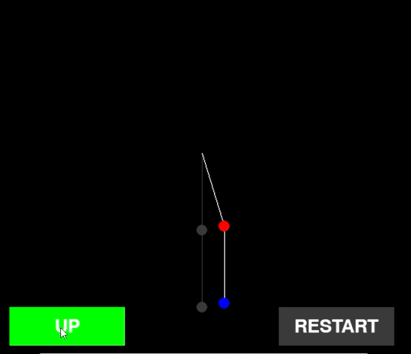
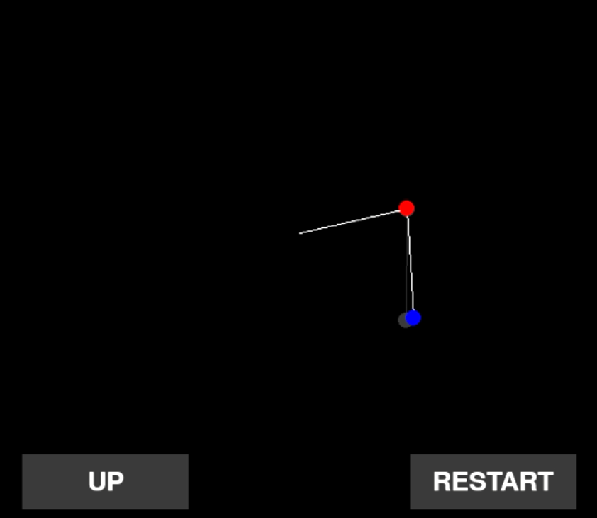
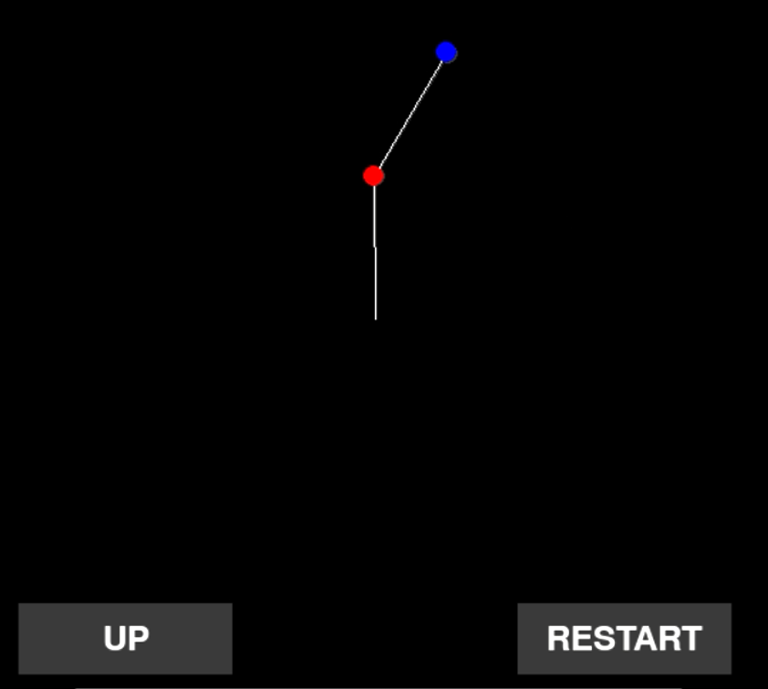
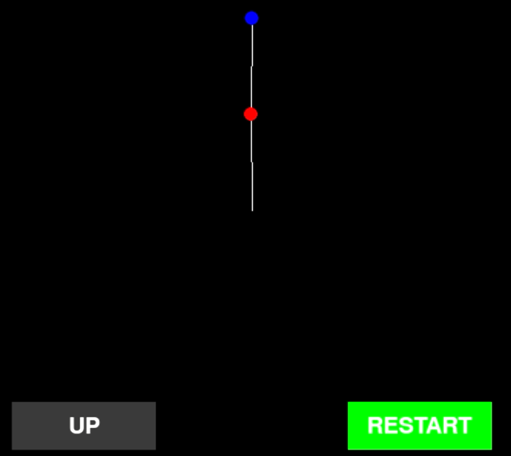

# Optimal Control of a Flexible Robotic Arm

This project focuses on designing **optimal trajectories** and **control strategies** for a flexible robotic arm modeled as a planar two-link system. The implementation includes trajectory generation using Newton's method, trajectory tracking via **LQR** and **MPC** controllers, and visualization through **Pygame animations**.

---

## Project Structure

```
text
├── animation.py          # Pygame animation of the robotic arm
├── armijo.py             # Armijo line search algorithm
├── cost.py               # Stage and terminal cost functions
├── dynamics.py           # System dynamics and linearization
├── LQR.py                # Linear Quadratic Regulator implementation
├── LQR_tracking.py       # LQR-based trajectory tracking
├── mpc.py                # Model Predictive Control implementations
├── plots.py              # Plotting functions for results visualization
├── ref_curve_task1.py    # Reference curve generation for Task 1
├── ref_curve_task2.py    # Reference curve generation for Task 2
├── Reg_Newton_Method.py  # Regularized Newton's method implementation
├── main_task_1.ipynb     # Jupyter notebook for Task 1
├── main_tasks_2-5.ipynb  # Jupyter notebook for Tasks 2-5
└── README.txt             
```

---

## Features

### System Modeling

* Discrete-time state-space representation of a two-link flexible robotic arm

### Trajectory Generation

* Equilibrium point computation
* Smooth cubic polynomial transitions between equilibria
* Swing-up motion generation
* Regularized Newton's method for optimal trajectory computation

### Trajectory Tracking

* LQR-based tracking with feedback linearization
* MPC implementations with rolling horizon optimization

### Visualization

* Comprehensive plotting of trajectories and tracking errors
* Interactive Pygame animation of the robotic arm

## Animation

The robotic arm execution can also be visualized through a **Pygame animation**.  
Below is a snapshot of the arm during trajectory tracking:

<p align="center">
  
  
  
  
</p>


---

## Requirements

* Python 3.7+
* NumPy
* Matplotlib
* Pygame
* CVXPY (for MPC implementation)
* Jupyter Notebook

---

## Installation

Clone the repository:

```bash
git clone https://github.com/VitCap01/Optimal_Control_of_a_Flexible_Robotic_Arm
cd flexible-robotic-arm-control
```

Install required packages:

```bash
pip install numpy matplotlib pygame cvxpy jupyter
```

---

## Usage

### Task 1: Trajectory Generation between Equilibria

Run `main_task_1.ipynb` to:

* Generate reference curves between two equilibrium points
* Compute optimal trajectories using Newton's method
* Visualize trajectory generation results

### Tasks 2-5: Swing-up Motion and Tracking

Run `main_tasks_2-5.ipynb` to:

* Generate swing-up motion reference curves
* Compute optimal swing-up trajectories
* Implement LQR and MPC tracking controllers
* Visualize tracking performance with perturbed initial conditions
* Animate the robotic arm executing the optimal trajectory

---

## Key Parameters

Configurable parameters in the notebooks include:

* `maxiters`: Maximum Newton method iterations
* `stepsize_0`, `beta`, `c`: Armijo line search parameters
* `Qt`, `Rt`, `QT`: Cost function weight matrices
* `Qreg`, `Rreg`, `QTreg`: LQR regulator weight matrices
* `pred_hor`: MPC prediction horizon
* `noise`: Initial condition perturbation vector

---

## Methodology

### System Dynamics

The robotic arm is modeled using Euler-Lagrange equations with states:

* `θ₁, θ₂`: Joint angles
* `ω₁, ω₂`: Angular velocities

### Trajectory Generation

* Regularized Newton's method with Armijo step size selection
* Quadratic cost function with state and input weighting
* Dynamics constraints enforced through iterative optimization

### Tracking Controllers

* **LQR**: Linearization around reference trajectory with feedback gain computation
* **MPC**: Rolling horizon optimization with system linearization

---

## Results

The implementation successfully:

* Generates smooth trajectories between equilibrium points
* Computes optimal swing-up motions
* Tracks reference trajectories under perturbed conditions
* Provides visualizations of state trajectories, control inputs, and tracking errors
* Animates the robotic arm's movement in real-time

---

## Contributors

* Vittorio Caputo
* Marco Drammis
* Sunil Shrikant Shikalgar

---

## License

This project was developed as part of the **Optimal Control course** at the University of Bologna.
